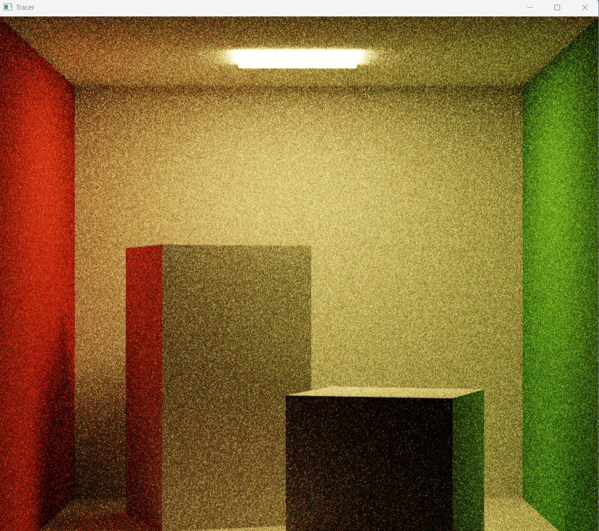
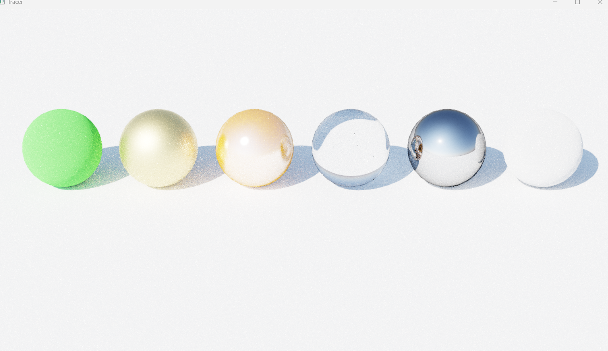
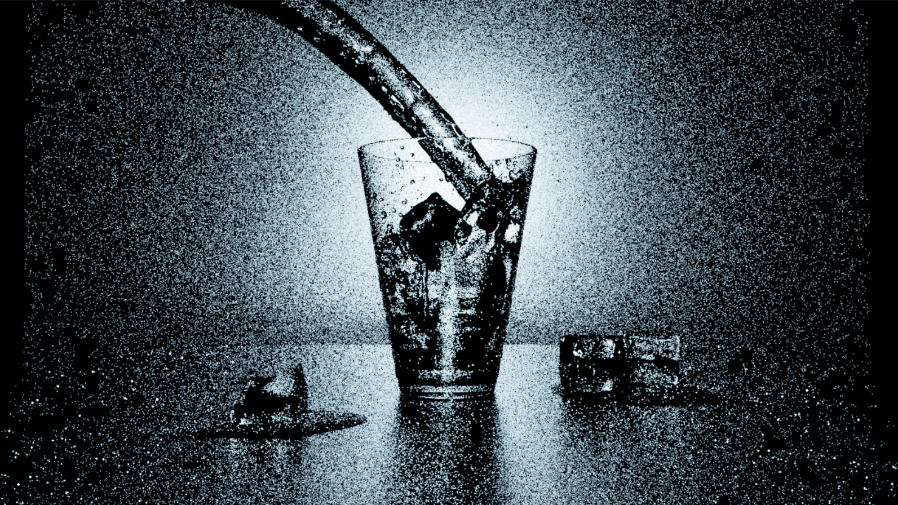
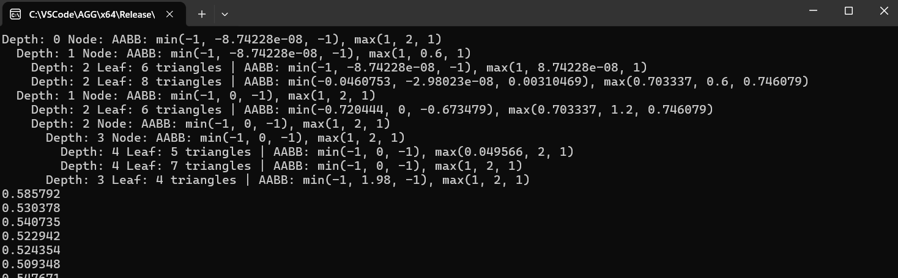
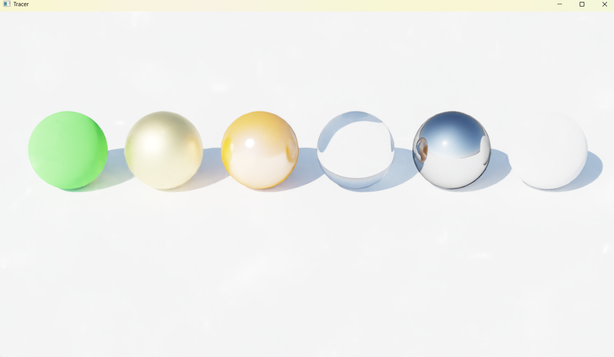
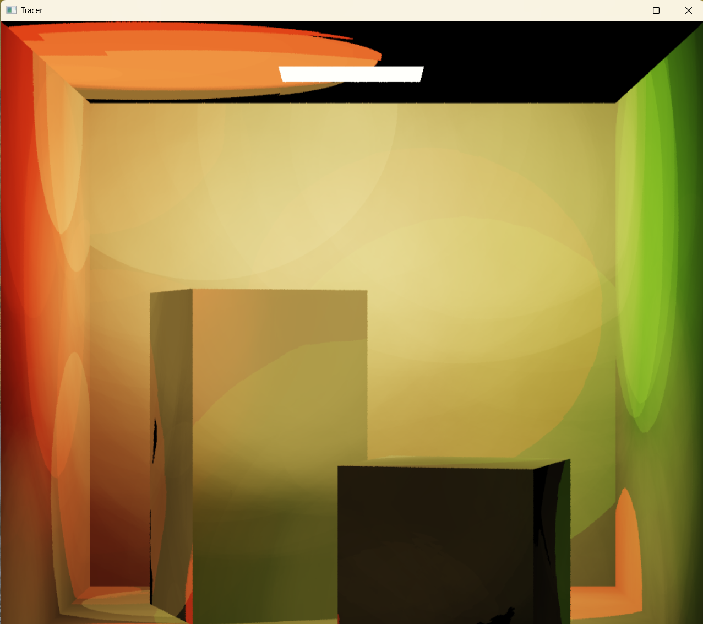

# Assignment instructions

## 1.Overview
This project implements 2 ways of ray tracing. One is MIS, the other is progressive photon mapping (PPM).

Here are two setting options here. 
```
bool PPMMode = false; 
bool denoising = false;
```
For "PPMMode=false", you can see MIS renderer. For "PPMMode=true", you can see PPM renderer.

"denoising" option is used to enable OIDN-based denoiser.


## 2.Material
I implemented the following materials:
```
1. Diffuse 
#Line 154-195, class DiffuseBSDF, Materials.h
2. Mirror
#Line 197-251, class MirrorBSDF, Materials.h
3. Conductor
#Line 254-352, class ConductorBSDF, Materials.h
4. Glass
#Line 354-524, class GlassBSDF, Materials.h
5. Oren-Nayar
#Line 626-704, class OrenNayarBSDF, Materials.h
6. Plastic
#Line 706-823, class PlasticBSDF, Materials.h

Helper Function
#Line 15-23, Line 48-119, Materials.h

I didn't implement Dielectric and Layered materials.
```
Here is some pictures about materials:

1. Diffuse (without denoiser)


2. MaterialScene (without denoiser)

From left to right, the materials are (1)Oren-nayar, (2)Conductor, (3)Plastic, (4)Glass,(5)Mirror, (6)Oren-nayar

3. Glass of water (without denoiser)


## 3.Speed up render times
1. BVH tree
```
#Line 249-431, class BVHNode, Geometry.h
"BVHNode" class defines the node of BVH tree

#Line 81, class Scene, Scene.h
std::unique_ptr<BVHNode> bvh = std::make_unique<BVHNode>();
This line is about how BVH tree is used. All of triangles are stored in the "bvh" of "Scene" class.
```
Here is a sample about the bvh of Cornell-box.


2. Use multiple threads to perform tile based rendering

(1) Devide the screen into tiles during initialization.
(2) Each frame push tiles into queue.
(3) Threads take tasks from the queue and render the tiles.
(4) Wait for all threads to finish.
(5) Present the image.
(6) Return to (2).

```
#Line 36-42, struct TileInfo, Renderer.h
This is the struct of a tile. "TileInfo" stores x and y as the position of screen and adaptive sampling information.

#Line 146 and 171-178, class RayTracer, Renderer.h
std::vector<TileInfo> tiles;
"tiles" stores the tiles of the screen. In line 178-178, it is initialized only once to store all the tiles of the screen.

#Line 144, 185-195 and 454, class RayTracer, Renderer.h
std::queue<TileInfo*> tileQueue;
"tileQueue" stores the multithreading tasks about tile based rendering.
It is re-filled each frame in "generateTiles()" function during rendering.

#Line 196-228 and 456, class RayTracer, Renderer.h
"renderTile()" is executed by multiple threads. In this function, a thread calculates the color of pixels of a tile for ray tracing, and then stores the result in "film". The following process like denoising is handled by main thread. 
```
3. A tile based adaptive sampler
   
At first, I implemented adaptive sampler based on tiles, according to the variance of the whole tile. But I found it inaccurate because some pixels haven't converged while their tiles have converged. 

So, I implemented a adaptive sampler based on pixels. Only all of pixels have converged, then their tile can be converged.

```
#Line 20-46, struct PixelStat, Imaging.h
"PixelStat" stores information about if a pixel is converged. Because when splatting, pixels can get additional color contribution without more sampling count, I changed "int numSamples" to "float weight". "weight" stores the accumulated weight of splatting. 

#Line 256, class Film, Imaging.h
std::vector<PixelStat> pixelStats;
This is where "PixelStat" is stored.

#Line 220-224, class RayTracer, Renderer.h
In the process of ray tracing, store the colors of pixels in "PixelStat" and check if a pixel is converged. If all pixels of a tile is converged, this tile will be marked as converged. A converged tile won't be pushed into multithreading task queue.
```
4. Denoiser
   
Through my test, denoiser only works with Box filter, but doesn't work with Guassian filter and Mitchell filter.
```
#Line 384-298, class Film, Imaging.h
These are about the initialization of denoiser.

#Line 291-321, class Film, Imaging.h
"denoise()" function is to execute denoising
```
A comparison between denoised and non-denoised images.

With denoiser:

Without denoiser:



## 4.environment lighting
1. environment maps
```
#Line 11-131, class Distribution1D and class Distribution2D, Lights.h
"Distribution2D" is used to store pdf of an environment map. 

#Line 283-386, class EnvironmentMap, Lights.h
The environment maps can be sampled by 2 latitude-longitude format.
```
The "MaterialScene" only contains environment lights and doesn't contain area lights. So this scene rendered normally means the environment map class works well.


2. MIS
```
#Line 229-411, class RayTracer, Renderer.h
"pathTraceMIS()" function calls "computeDirectMIS()".
Each pixel is combined with two parts: direct lighting and indirect lighting.
Direct lighting contains lighting sampling and bsdf sampling.
Indirect lighting is to generate next ray bounce based on material bsdf and calculate its contribution to the original pixel.
```
All the pictures above is rendered by MIS.


## 5.Progressive Photon Mapping

```
#Line 487-710, class RayTracer, Renderer.h
"PPM_init()", "PPM_GenerateHP_Multithread()" and "PPM_GenerateHP_Bounce()" are to generate hit points from the screen. For my settings, each pixel on the screen generate 4 rays. If the ray hits mesh in the scene, a hit point will be added to "std::vector<std::vector<HitPoint>> hitPoints".

"renderPPM()" is the main PPM rendering function. It is excuted every frame. It uses multithreading to speed up. Multiple threads execute "PPM_GeneratePhoton_MultiThread()" to genetate photons and store hit results if any photon hits a hit point. Then "renderPPM()" calculates the hit results and the final colors of pixels. 
```
Here is the rendering result of PPM. 

It looks not very good. I think one of the main reasons is the number of generated photons each frame, which is 1000 now. (If I set photons number to 2000 or higher, it will take 5 minutes to generating one frame.) But due to the complexity of PPM multi-threaded competition, designing a lock-free synchronization costs much time. So I stopped here. I guess the picture will look better with more photons each frame. 